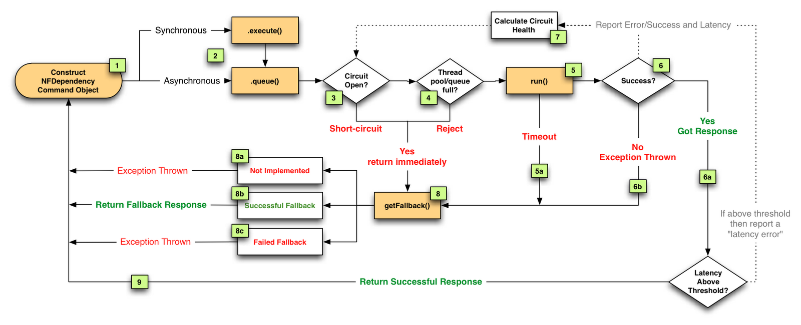

1) https://github.com/Netflix/Hystrix

2) https://github.com/Netflix/Hystrix/wiki

3) https://medium.com/netflix-techblog/making-the-netflix-api-more-resilient-a8ec62159c2d

4) https://medium.com/netflix-techblog/fault-tolerance-in-a-high-volume-distributed-system-91ab4faae74a

5) https://speakerdeck.com/benjchristensen/performance-and-fault-tolerance-for-the-netflix-api-august-2012
https://speakerd.s3.amazonaws.com/presentations/50356a43d135ef0002003bdc/FaultTolerancePresentation-August2012.pdf

6)

